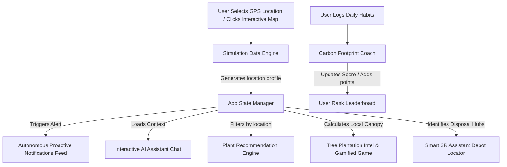

# 🌍 EcoGuardian AI — Personal Environmental & Sustainability Assistant

**Track**: Agents for Good

EcoGuardian AI is a GPS-powered autonomous AI environmental assistant that continuously analyzes the user's surroundings and provides personalized environmental guidance. Rather than just displaying basic weather, it understands what the environment means for the user, providing proactive warnings, health precautions, plant selection advice, carbon footprint coaching, and 3R coordination.

---

## 🎯 Problem Statement

Millions of people unknowingly live, travel, or work in environments that negatively affect their health and the planet. 

* **AQI & Construction:** Is today's air quality dangerous? Is nearby construction causing excessive dust or noise?
* **Water Safety:** Is local water contaminated or suffering shortages?
* **Actionable Advice:** What precautions should be taken? Which plants can reduce local air pollution?
* **Carbon Impact:** How can individuals reduce their carbon footprint and practice the 3Rs (Reduce, Reuse, Recycle)?
* **Reforestation:** Where can they find and participate in local planting campaigns?

Currently, this data is scattered across maps, news, weather apps, and municipal portals. **EcoGuardian AI** integrates this context and provides autonomous, proactive alerts to protect the user and the planet.

---

## 🛠️ Tech Stack

* **Frontend Engine:** React 19 + Vite 6 (Single Page Application)
* **Styling & Aesthetics:** Custom Vanilla CSS (Futuristic Glassmorphic Dark System, Custom HSL variables, smooth sliding keyframes, and pulse-glow indicators)
* **Icons:** Lucide React (Premium, high-definition icons)
* **Management & Automation:** NPM & PowerShell scripting
* **Repository Operations:** Git & GitHub CLI (`gh`)

---

## 🧭 Application Workflows & System Architecture

Below is the conceptual workflow illustrating how the Autonomous Agent updates location states, feeds proactive logs, and updates the carbon coach and plant recommenders:



### Key Workflows:
1. **GPS presets change:** Selecting a preset (Downtown, Suburbs, Industrial, Coastal, Wildfire) instantly pushes a custom proactive alert onto the user's notification tray (e.g., advising an N95 mask or highlighting a coastal tide warning).
2. **AI Chat alignment:** The chatbot automatically scans the active GPS profile, tailoring responses specifically to the user's current environment.
3. **Carbon logging:** Toggling commute, energy, and water saving habits recalculates a sustainability score and writes points to the user's badge rank.
4. **Virtual tree planting:** Clicking watering and soil actions triggers CSS growth animations. Once fully grown, the system awards +30 Eco Points.

---

## 🌟 Key Features

1. **Smart Location Analysis & Map:** Interactive vector SVG map of EcoCity. Clicking on map districts triggers live GPS teleportation.
2. **Air Quality & Weather intelligence:** Gauges for AQI, detailed PM2.5/PM10 concentration trackers, and heatwave indices.
3. **Water Quality & Construction Alerts:** Advisories on TDS, pH, active construction dust levels, and noise pollution decibels.
4. **Autonomous AI Assistant:** Proactive notifications log and full Q&A console with suggestions.
5. **Carbon Footprint Coach:** Daily habit trackers and a customized SVG bar chart showing the last 7 days of CO₂ avoidance.
6. **Plant Recommendation Engine:** Clean, filtered directory of beneficial plants matching location pollutants.
7. **Smart 3R Assistant:** Actionable checklists and GPS-mapped coordinates for nearby E-waste, metal, and plastic recycling centers.
8. **Tree Plantation & Leaderboard:** Region-based canopy indicators, community leaderboards, and a virtual tree planting game.

---

## 🚀 Getting Started

### Prerequisites
* Node.js (v18+)
* NPM (v10+)

### Running Locally
1. Clone this repository:
   ```bash
   git clone <repository-url>
   cd "ECOGUARDIAN AI"
   ```
2. Install dependencies:
   ```bash
   npm install
   ```
3. Start the Vite development server:
   ```bash
   npm run dev
   ```
   Open `http://localhost:3000/` in your web browser.

4. Build production bundle:
   ```bash
   npm run build
   ```
